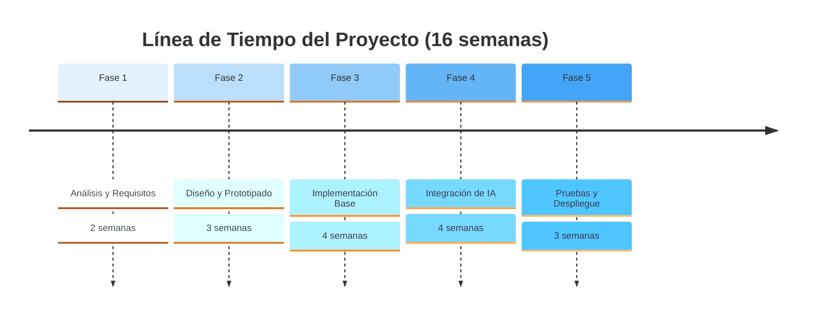

# Línea de Tiempo del Proyecto

## Paleta de Azules Utilizada

El diagrama ahora usa una escala de azules basada en Material Design:

- **cScale0** (#E3F2FD) - Azul muy claro
- **cScale1** (#BBDEFB) - Azul claro
- **cScale2** (#90CAF9) - Azul suave
- **cScale3** (#64B5F6) - Azul medio-claro
- **cScale4** (#42A5F5) - Azul medio
- **cScale5** (#2196F3) - Azul principal
- **cScale6** (#1E88E5) - Azul medio-oscuro
- **cScale7** (#1976D2) - Azul oscuro
- **cScale8** (#1565C0) - Azul muy oscuro
- **cScale9-11** (#0D47A1, #1565C0) - Azules profundos

Esta paleta proporciona un gradiente suave de azules que se aplicará automáticamente a las diferentes secciones del timeline.
